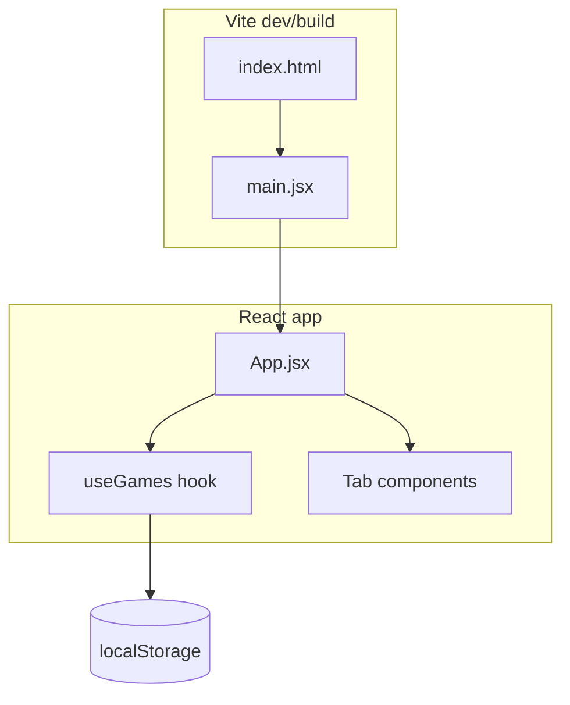

# Development Notes

## Architecture

- **Entry:** `index.html` → `src/main.jsx` → `src/App.jsx`
- **State:** `useGames` loads/saves game array; legacy key `averyGames` is read first, then `assistanalytics-games`
- **No router** — tab switching via `activeTab` string state
- **No API** — fully client-side

## File map

| Path | Purpose |
|------|---------|
| `src/App.jsx` | Shell, header, nav, tab routing |
| `src/hooks/useGames.js` | Games state + localStorage persistence |
| `src/data/defaultGames.js` | Seed data (3 tournament games) |
| `src/utils/stats.js` | eFG%, AST/TO, per-minute, benchmarks, target parsing |
| `src/utils/youtube.js` | YouTube ID extraction, timestamp parsing |
| `src/utils/exportPdf.js` | html2pdf wrapper for dashboard/box score |
| `src/components/DashboardTab.jsx` | Totals, box score table, per-24/32 |
| `src/components/LogsTab.jsx` | Game cards, play-by-play, URL inputs |
| `src/components/BenchmarksTab.jsx` | Development targets table |
| `src/components/FilmRoomTab.jsx` | Clip playlist + embed player |
| `src/components/StatCard.jsx` | Dashboard summary card |
| `archive/gemini-original-index.html` | Unmodified single-file prototype |

## Stat glossary

### Standard (formula in code)

| Stat | Definition |
|------|------------|
| **eFG%** | `(FGM + 0.5 × 3PM) / FGA × 100` |
| **AST/TO** | `assists / turnovers` when TOV > 0; else raw assist count |
| **Per 24 / 32** | `(stat / minutes) × base` |
| **3PT%** | `3PM / 3PA × 100` (benchmarks tab) |
| **REB** | `OREB + DREB` |

### Custom / unclear (do not assume NBA definitions)

| Stat | Notes |
|------|-------|
| **PTCH** | Paint touches — manual count in box score; also inferred from play-by-play text |
| **HQPA** | High-quality play assist — added to assists in `AST + HQPA` benchmark; meaning not defined in code |
| **LB TOV** | Initiator live-ball turnover — tracked separately from total **TOV** |
| **DEFL** | Deflections — manual count |
| **+/-** | Plus/minus — entered manually per game in seed data; no on-court calculation in app |

## Fragile areas

1. **Benchmark target parsing** (`parseBenchmarkTarget` in `stats.js`) — Handles `5+`, `≤ 2`, and simple ranges; fails gracefully to neutral gray for `"Near Zero"`, `"2:1+"`, etc.
2. **Film filters** — Substring search on lowercase play text; `"def"` matches many descriptions.
3. **localStorage schema** — No versioning; schema changes could break saved data.
4. **html2pdf** — Large tables may clip or paginate poorly; test after UI changes.
5. **YouTube embed** — Depends on video privacy settings and embed permissions.

## Recommended next refactors

1. Add TypeScript for game/stat shapes
2. Extract `Game` type and validation (Zod or manual)
3. Unit tests for `stats.js` (eFG%, benchmark parsing)
4. Game CRUD UI + JSON import/export
5. Replace keyword film filters with tagged events in play-by-play schema
6. Document or rename custom stats with a settings/legend panel

## Original prototype

The Gemini-generated single-file app lives at `archive/gemini-original-index.html`. It used CDN React, Babel-in-browser, unused Recharts imports, and key `averyGames`.
