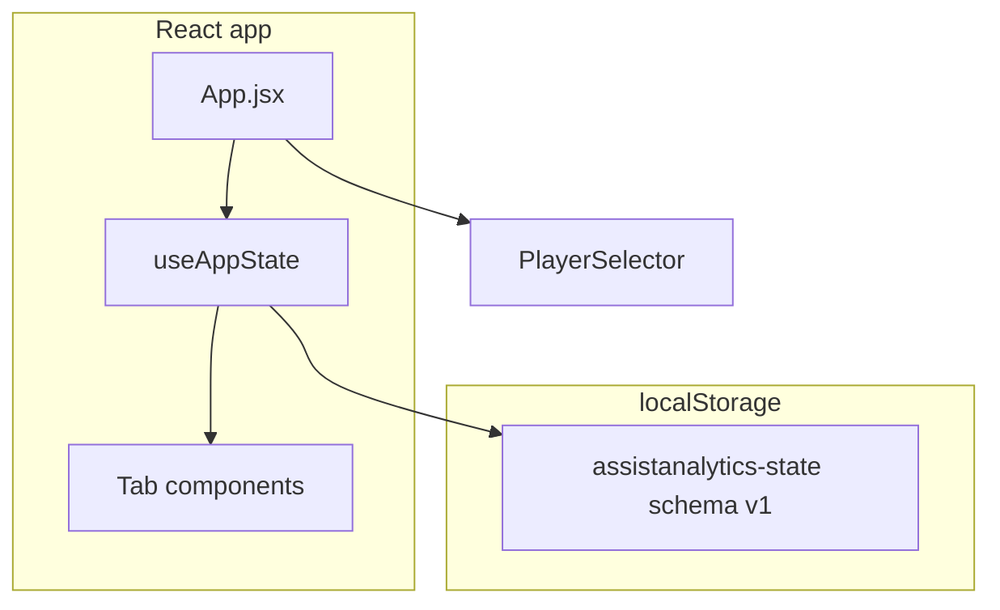

# Development Notes

## Architecture



- **Entry:** `index.html` → `src/main.jsx` → `src/App.jsx`
- **State:** Single `AppState` blob with `players`, `games`, `benchmarkSets`, `activePlayerId`
- **Legacy:** Reads `averyGames` or `assistanalytics-games` once, migrates to v1, then uses `assistanalytics-state` only
- **No router** — tab switching via `activeTab` string state

## AppState (schema version 1)

```js
{
  schemaVersion: 1,
  activePlayerId: string | null,
  players: Player[],
  games: Game[],
  benchmarkSets: BenchmarkSet[]
}
```

- **Player** — `id`, `firstName`, `displayName`, optional profile fields, timestamps
- **Game** — `id`, `playerId`, `date`, `opponent`, `stats`, `playByPlay`, `competition`, `videoUrl`, timestamps
- **BenchmarkSet** — one per player; `targets[]` drives Benchmarks tab

Default player id: `player-avery-default`. Seed games: `game-avery-1` … `game-avery-3`.

## File map

| Path | Purpose |
|------|---------|
| `src/hooks/useAppState.js` | Load/save AppState, player switch, add player, update video URL |
| `src/storage/loadState.js` | Load + migrate legacy storage |
| `src/storage/saveState.js` | Persist AppState |
| `src/storage/migrateLegacyGames.js` | Legacy games array → v1 |
| `src/data/defaultAppState.js` | Fresh-install seed |
| `src/data/defaultBenchmarkTargets.js` | Benchmark rows cloned per new player |
| `src/utils/gameStats.js` | Normalize stats; legacy `tpm`/`lbTov`/`oreb` support |
| `src/utils/migrateGame.js` | Legacy game → v1 Game |
| `src/utils/stats.js` | Aggregations, eFG%, benchmark parsing |
| `src/components/PlayerSelector.jsx` | Header player dropdown |
| `src/components/AddPlayerForm.jsx` | Create player + benchmark set |

## Stat glossary

### Standard (formula in code)

| Stat | Definition |
|------|------------|
| **eFG%** | `(FGM + 0.5 × 3PM) / FGA × 100` |
| **AST/TO** | `assists / turnovers` when TOV > 0; else raw assist count |
| **Per 24 / 32** | `(stat / minutes) × base` |
| **3PT%** | `threePm / threePa × 100` |
| **REB** | Single `reb` field (legacy oreb+dreb summed on migrate) |

### Custom / unclear

| Stat | Notes |
|------|-------|
| **PTCH** | Paint touches |
| **HQPA** | High-quality play assist (benchmark: AST + HQPA) |
| **liveBallTov** | Initiator live-ball turnover (was `lbTov`) |
| **DEFL** | Deflections |
| **+/-** | Manually entered per game |

## Fragile areas

1. **Benchmark parsing** — Non-numeric targets stay neutral gray
2. **Film filters** — Substring matching on play text
3. **Hooks** — `FilmRoomTab` must call hooks before any early return
4. **Schema** — Bump `schemaVersion` and add migration when shape changes

## Next steps (Phase 0+)

1. Game CRUD UI
2. JSON import/export
3. Stat legend in UI
4. Structured play events
5. TypeScript + tests for `stats.js`

## Original prototype

`archive/gemini-original-index.html` — single-file CDN app with key `averyGames`.
